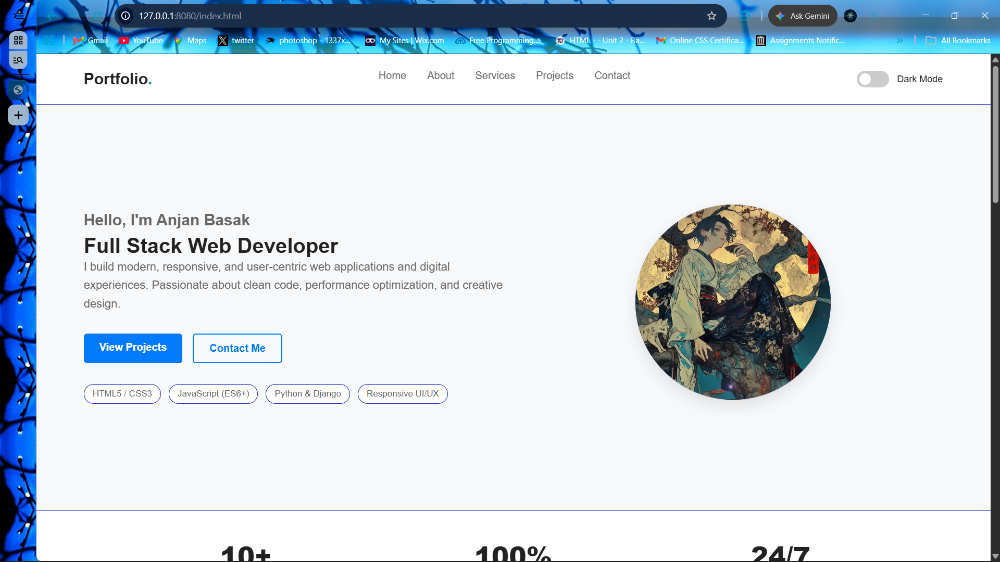
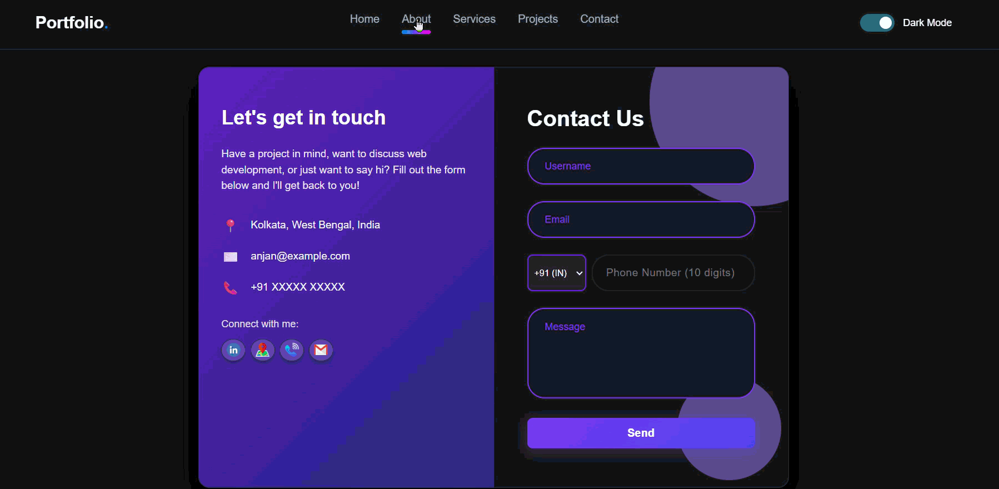
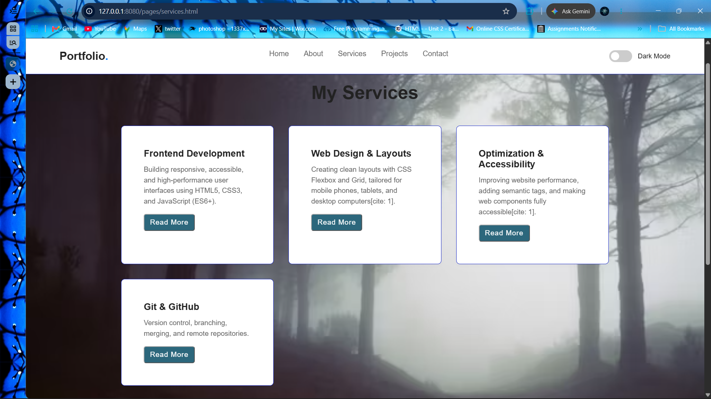
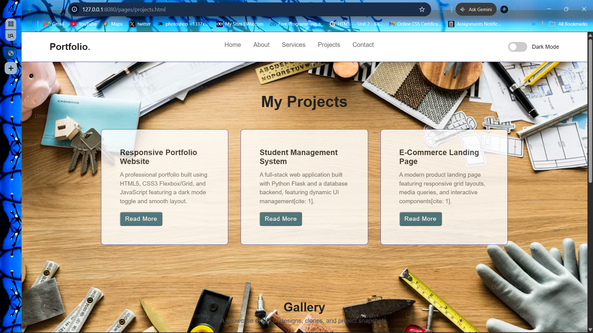
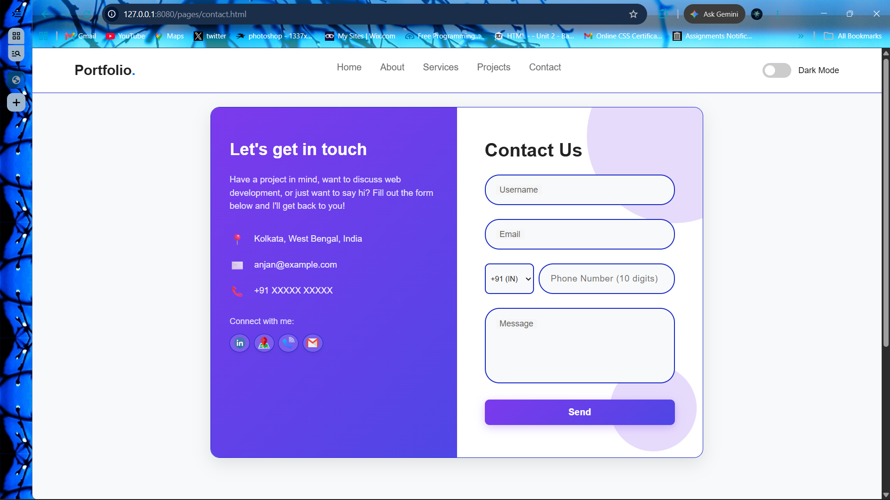

# Responsive Personal Portfolio & Business Landing Website — Sumerix Global Internship (Task-1)

A responsive, multi-page personal portfolio and business landing web application built as part of the **Full Stack Web Development Internship** This project demonstrates fundamental web development techniques, including semantic HTML5 structure, modular CSS3 styling, ES6+  JavaScript interaction, mobile-first responsive design, web accessibility (WCAG/ARIA) standards, and Git/GitHub version control workflows.

A lightweight, multi-page web platform designed as a personal developer portfolio and showcase landing page. Built using pure, dependency-free HTML5, CSS3, and ES6+ Vanilla JavaScript to deliver maximum performance, fast load times, and clean UI architecture.
## 📑 Table of Contents

- [Project Overview & Core Motivations](#project-overview--core-motivations)
- [Comprehensive Features](#comprehensive-features)
- [Detailed Tech Stack & Specifications](#detailed-tech-stack--specifications)
- [Environment Variables](#environment-variables)
- [Screenshots](#screenshots)
- [Usage/Examples](#usageexamples)
- [Documentation](#documentation)
- [Quick Start & Setup Guide](#quick-start--setup-guide)
  - [Prerequisites](#prerequisites)
  - [Installation & Local Execution](#installation--local-execution)
- [Repository Structure](#repository-structure)
- [Detailed System Architecture](#detailed-system-architecture)
- [Component & Dynamic Scripting Deep Dive](#component--dynamic-scripting-deep-dive)
  - [Dark Mode State Engine & LocalStorage Persistence](#dark-mode-state-engine--localstorage-persistence)
  - [Client-Side Form Interceptor & Regex Validation](#client-side-form-interceptor--regex-validation)
  - [Accessible Mobile Navigation Drawer](#accessible-mobile-navigation-drawer)
- [Developer Customization & Retheming Manual](#developer-customization--retheming-manual)
  - [CSS Design Tokens & Theme Variables](#css-design-tokens--theme-variables)
  - [Route Architecture & Adding Subpages](#route-architecture--adding-subpages)
  - [Adding Showcase Projects & Metadata Cards](#adding-showcase-projects--metadata-cards)
- [Quality Assurance & Automated Testing](#quality-assurance--automated-testing)
- [Versioning & Semantic Changelog](#versioning--semantic-changelog)
- [FAQ](#faq)
- [Feedback](#feedback)
- [Support](#support)
- [Related](#related)
- [Acknowledgements](#acknowledgements)
- [Contribution Guidelines & Workflow](#contribution-guidelines--workflow)
- [Community Code of Conduct](#community-code-of-conduct)
- [Deployment & Production Hosting](#deployment--production-hosting)
- [License](#license)
- [Pre-Flight Developer Checklist](#pre-flight-developer-checklist)
- [Common Pitfalls & Architectural Solutions](#common-pitfalls--architectural-solutions)

---
## Project Overview

Modern web development frequently relies on heavy framework overhead, complex node module chains, and transpilation build steps. This project demonstrates a pure, framework-free web platform capable of delivering high performance, structured componentry, and fluid user interactions without external npm runtime dependencies.
* **Zero-Framework Architecture:** Eliminates build-tool fatigue (`npm`, Webpack, Vite, Babel) to ensure instant site loads, zero vulnerability audits, and straightforward hosting requirements.

* **Maintainable Design Systems:** Leverages native CSS Custom Properties (`:root` variables) to manage site-wide typography, spacing scales, light/dark themes, and component colors across multiple isolated HTML files.

* **Accessible UI Componentry:** Implements strict semantic HTML structures (`<header>`, `<nav>`, `<main>`, `<article>`, `<section>`, `<footer>`) alongside dynamic ARIA states (`aria-expanded`, `aria-hidden`) to ensure screen reader compatibility.

* **Client-Side State Persistence:** Utilizes JavaScript DOM manipulation and browser `localStorage` APIs to retain user configuration choices, such as dark/light display preferences, across page navigations.

---
## Features


* **Zero Build Dependencies:** Native HTML5, CSS3, and ES6+ JavaScript executing directly within any standard browser engine without requiring node modules or build steps.

- **Modular CSS System:** Style sheet architecture divided into dedicated files for design tokens/variables `(style.css)`, responsive layouts `(responsive.css)`, and UI keyframes `(animations.css)`.

* **Persistent Dark/Light Theme Engine:** Dynamic theme switcher that automatically detects system preferences (`prefers-color-scheme`) while providing a toggle override that persists in `localStorage`.

- **Client-Side Form Interceptor:** Non-reloading `contact form` engine featuring Regular Expression email formatting checks and dynamic alert toast notifications.

- **Standardized Showcase Cards:** Modular project card layout complete with tech stack tags, lazy-loaded images `(loading="lazy")`, and repository/live demo links.

- **Multi-Page Route Architecture:** Clean directory structure connecting main pages `(about.html, projects.html, services.html, contact.html)` using scalable relative paths.

* **Asynchronous Form Interceptor:** Non-reloading contact form handling system built with JS that validates input fields, verifies email formatting via Regular Expressions, and renders `dynamic alert notifications`.

* **Responsive Mobile Navigation Drawer:** Touch-friendly mobile menu toggle system that dynamically updates accessible ARIA states and locks background scrolling when active.

* **Optimized Showcase Cards:** Standardized card component layout featuring technology badge tags, media wrappers with lazy-loading attributes (`loading="lazy"`), and repository/demo links.

---
## Detailed Tech Stack

- **Markup Layer:** HTML5 (Semantic document architecture, native form controls, ARIA landmark roles)

- **Styling Layer:** CSS3 (Custom properties design tokens, Flexbox, CSS Grid, media query breakpoints, keyframe animations)

- **Scripting Layer:** JavaScript ES6+ (DOM events, *DOM manipulation*, asynchronous form interceptors, Web Storage API, matchMedia API)

- **Asset Pipeline:** Vector SVG icons, web-optimized raster graphics `(PNG/WEBP)`, and modular standard stylesheets

- **Version Control & Hosting:** Git versioning, GitHub Actions CI validation, deployment support for *GitHub Pages*, Vercel, or Netlify
## Environment Variables

Since this project runs as a pure static web application on the client side, no private backend credentials or secret API keys are required to build or host the base interface. 

If connecting third-party static API providers (e.g., Formspree or EmailJS for direct form routing), configure runtime variables within a `.env.example` file or via your hosting provider's build dashboard:

` Optional Third-Party Service Configurations
PORTFOLIO_CONTACT_ENDPOINT=[https://formspree.io/f/your_form_id](https://formspree.io/f/your_form_id)
PORTFOLIO_ANALYTICS_ID=UA-XXXXX-Y`

## Screenshots

### Core Application Views
| Primary Home Landing Page | About Me Overview |
| :---: | :---: |
|  |  |

| Services & Solutions | Projects Showcase |
| :---: | :---: |
|  |  |

### Interactive Theme Engine (Contact View)
| Contact Page (Light Mode) | Contact Page (Dark Mode) |
| :---: | :---: |
|  |  |

### Interactive Theme Engine (Contact View)
| Home Page (Light Mode) |
| :---: | 
|  |

## Usage/Examples

### Standard Project Card Component

To add a new item to your project catalog (`pages/projects.html`), insert this structure inside the primary grid container:

```
html
<article class="project-card">
    <div class="project-image-wrapper">
        
    </div>
    <div class="project-content">
        <h3 class="project-title">Developer Portfolio</h3>
        <p class="project-description">
            A responsive personal portfolio website highlighting projects, technical skill sets, and professional background.
        </p>
        <div class="project-tags">
            <span class="tag">HTML5</span>
            <span class="tag">CSS3</span>
            <span class="tag">JavaScript</span>
            <span class="tag">Bootstrap</span>
        </div>
        <div class="project-links">
            <a href="https://github.com/your-username/developer-portfolio" target="_blank" rel="noopener" class="btn btn-secondary">Source Code</a>
            <a href="https://demo-link.com" target="_blank" rel="noopener" class="btn btn-primary">Live Demo</a>
        </div>
    </div>
</article>
```
## Documentation

This repository provides comprehensive development guides, structural architectural blueprints, and step-by-step technical walkthroughs to assist developers in understanding, extending, and maintaining the project. 

For detailed information on specific subsystems, refer to the technical breakdowns below:

---

### 🏛️ Architecture Guide
* **Static Asset Management:** Comprehensive breakdown of how HTML documents link to modular CSS stylesheets (`style.css`, `responsive.css`, `animations.css`) across root and subfolder (`/pages/`) directories using clean relative pathing.

* **Script Load & Execution Lifecycle:** Step-by-step flow detailing how non-blocking JavaScript modules (`script.js`, `navigation.js`, `validation.js`) are deferred, initialized, and bound to the DOM during document parsing.

* **Asset Dependency Graph:** Visual and text-based representation showing the cascade hierarchy of CSS design tokens, typography imports, and static vector media dependencies.

* **Performance & Asset Optimization:** Strategies used to minimize render-blocking requests, enforce native browser caching, and ensure zero-dependency performance without bundlers.

---

### 🧩 Component Deep Dive
* **Dark Mode & Theme Engine (`script.js`):** Deep dive into the initialization logic that checks `localStorage` tokens, falls back to `prefers-color-scheme` media queries, and applies real-time `data-theme` attribute switches to the document root.

* **Form Interceptor & Regex Validation (`validation.js`):** Technical breakdown of client-side submit listeners, input sanitization routines, Regular Expression evaluation patterns, and dynamic UI alert/toast rendering.

* **Accessible Navigation Drawer (`navigation.js`):** Explanation of mobile menu event bindings, backdrop scroll locking, and real-time ARIA attribute management (`aria-expanded`, `aria-hidden`) for keyboard and screen-reader compliance.

* **Dynamic DOM Event Listeners:** Complete index mapping all target selectors, event triggers (`click`, `submit`, `change`), and corresponding callback functions across the application.

---

### 🛠️ Developer Manual
* **Configuring CSS Design Tokens:** Step-by-step instructions for customizing global color variables, font families, elevation shadows, and spacing scales inside the `:root` and `[data-theme="dark"]` selectors.

* **Subpage Routing & Layout Architecture:** Standardized walkthrough for introducing new subpages to the `/pages/` directory while maintaining consistent header navigation, relative links, and footer components.

* **Adding Showcase Items:** Guidelines and reusable HTML code templates for introducing new project cards, technology tag badges, and interactive media wrappers into catalog pages.

* **Deployment & Pre-Flight Testing:** Checklist and instructions for testing relative pathing, verifying cross-browser viewport responsiveness, and publishing updates via static hosting platforms.

# Quick Start & Setup Guide

## Prerequisites

To view, edit, and execute this multi-page platform locally, ensure your system has the following core development utilities configured:

### Modern Web Browser Engine
A current-generation browser fully compliant with HTML5 semantic elements, CSS3 Flexbox/Grid modules, and ES6+ JavaScript APIs.
* **Google Chrome** (v90+) — *Recommended for DevTools performance auditing*
* **Mozilla Firefox** (v88+) — *Recommended for CSS Grid inspector tools*
* **Microsoft Edge** (v90+)
* **Apple Safari** (v14+)

### Source Code Editor / IDE
An extensible code editor equipped with syntax highlighting, auto-completion, and file directory trees.
* **Visual Studio Code** — *Strongly recommended for optimal extension integration*
* **Sublime Text** or **JetBrains WebStorm**

### Code Formatting & Quality Tools
* **Prettier (Code Formatter):** Recommended for enforcing consistent code style, indentation (2 spaces), and clean formatting across HTML, CSS, and JS files. Can be integrated directly via the **Prettier - Code formatter** extension in VS Code or run via CLI (`npx prettier --write .`).

### Local Web Server Utilities (Optional)
* **VS Code Live Server Extension:** Enables instant hot-reloading in the browser whenever source files (`.html`, `.css`, `.js`) are saved.
* **Node.js Environment** (v14+): Optional runtime to execute Prettier CLI commands or lightweight zero-config static file servers (such as `npx serve` or `http-server`) via CLI.

### Version Control System
* **Git CLI** (v2.25+): Required to clone the source repository, manage feature branches, and submit pull requests.
---


### Installation & Local Execution

1. **Clone the Git Repository:**

   ```git clone [https://github.com/your-username/portfolio-website.git](https://github.com/your-username/portfolio-website.git)```

2. **Navigate to the Root Directory:**
      
           cd portfolio-website


3. **Launch the Local Development Server**

- **Method 1:** *(VS Code Live Server - Recommended)*
Right-click `index.html` inside Visual Studio Code and select **Open with Live Server**.

- **Method 2:** *(Node Static Server)*

        npx serve

- **Method 3:** *(Direct File System Execution)* Open `index.html` directly inside your web browser.
## Repository Structure
```
plaintext

portfolio-website/
├── assets/
│   ├── css/
│   │   ├── style.css         # Design tokens, color schemes, typography, & base resets
│   │   ├── responsive.css    # Responsive breakpoints (mobile, tablet, desktop viewports)
│   │   └── animations.css    # Transitions, hover transforms, & keyframe animations
│   ├── js/
│   │   ├── script.js         # Theme toggle engine, preference listener, & local storage
│   │   ├── validation.js     # Form event interceptor, Regex validation, & UI alert generator
│   │   └── navigation.js     # Mobile menu drawer logic & accessibility ARIA handlers
│   ├── images/               # Application UI graphics, avatars, and project previews
│   │   ├── desktop-preview.png
│   │   ├── projects-page.png
│   │   ├── services-page.png
│   │   ├── contact-validation.png
│   │   └── Dark Mode Toggle.gif
│   ├── icons/                # Vector SVG icons for badges and navigation elements
│   └── fonts/                # Web typography font files (.woff2 format)
├── pages/
│   ├── about.html            # Profile bio, skills matrix, experience timeline
│   ├── projects.html         # Categorized project catalog with live repository links
│   ├── services.html         # Technical services, consulting options, & solutions breakdown
│   └── contact.html          # Interactive contact form page with validation engine
├── index.html                # Application root landing page & hero banner section
├── README.md                 # Complete technical documentation & developer manual
└── .gitignore                # System and IDE file exclusions
```
## Detailed System Architecture

```
[ Client Browser Request ]
           │
           ├──> Load Requested HTML Target (index.html OR pages/*.html)
           │          │
           │          ├──> Parse Cascading Stylesheet Stack:
           │          │       ├──> 1. style.css       (Root variables & global element reset)
           │          │       ├──> 2. responsive.css  (Viewport media queries & fluid grids)
           │          │       └──> 3. animations.css  (Visual transitions & state effects)
           │          │
           │          └──> Execute Deferred Script Modules:
           │                  ├──> script.js      (Read localStorage theme token & apply 'data-theme')
           │                  ├──> navigation.js  (Bind menu drawer events & update 'aria-expanded')
           │                  └──> validation.js  (Attach form event listeners & Regex engines)
           │
[ Form Submission Event on contact.html ]
           │
           └──> validation.js Intercepts Submit Event
                      │
                      ├──> Validation Fails ──> Prevent Page Reload ➔ Render Error Toast
                      └──> Validation Passes ──> Process Form Payload ➔ Render Success Toast & Reset Controls           
```                   


# Component & Dynamic Scripting Deep Dive
## Dark Mode State Engine & LocalStorage Persistence

The core theme manager inside `assets/js/script.js` evaluates local storage tokens and system preferences before mutating the root element's `data-theme` attribute:
```
/* --- Theme Manager --- */
function initThemeManager() {
  const toggleSwitch = document.querySelector(SELECTORS.themeToggleSwitch);
  const currentTheme = localStorage.getItem("theme");

  if (currentTheme) {
    document.documentElement.setAttribute("data-theme", currentTheme);
    if (toggleSwitch && currentTheme === "dark") {
      toggleSwitch.checked = true;
    }
  }

  if (toggleSwitch) {
    toggleSwitch.addEventListener("change", (e) => {
      const newTheme = e.target.checked ? "dark" : "light";
      document.documentElement.setAttribute("data-theme", newTheme);
      localStorage.setItem("theme", newTheme);
    });
  }
}
```
## Client-Side Form Interceptor & Regex Validation

The validation module in `assets/js/validation.js` intercepts native submit events to run synchronous validation checks without causing full page refreshes:
```
document.addEventListener("DOMContentLoaded", () => {
  const inputs = document.querySelectorAll(".input");
  const contactForm = document.getElementById("contactForm");
  const successMessage = document.getElementById("successMessage");
  const phoneInput = document.getElementById("phoneInput");
  const phoneError = document.getElementById("phoneError");

  function focusFunc() {
    let parent = this.parentNode;
    parent.classList.add("focus");
  }

  function blurFunc() {
    let parent = this.parentNode;
    if (this.value == "") {
      parent.classList.remove("focus");
    }
  }

  inputs.forEach((input) => {
    input.addEventListener("focus", () => {
      input.parentNode.classList.add("focus");
    });

    input.addEventListener("blur", () => {
      if (input.value === "") {
        input.parentNode.classList.remove("focus");
      }
    });
  });

  // Handle form submission with 10-digit phone verification
  if (contactForm) {
    contactForm.addEventListener("submit", (e) => {
      e.preventDefault(); // Stop default form submit

      // Clean input to check digit count only
      const phoneVal = phoneInput.value.trim();
      const phoneDigitsOnly = phoneVal.replace(/\D/g, ""); // strip non-numeric characters

      // Validation rule: Must be exactly 10 digits
      if (phoneDigitsOnly.length !== 10) {
        phoneInput.classList.add("error");
        phoneError.style.display = "block";

        // Optional soft shake effect invocation
        phoneInput.focus();
        return; // Prevent form from submitting successfully
      } else {
        phoneInput.classList.remove("error");
        phoneError.style.display = "none";
      }

      // If validation passes, display success notification
      successMessage.style.display = "block";
      contactForm.reset();

      // Clear input labels
      inputs.forEach((input) => {
        input.parentNode.classList.remove("focus");
      });

      // Hide success message automatically after 5 seconds
      setTimeout(() => {
        successMessage.style.display = "none";
      }, 5000);
    });
  }
});
```

## Accessible Mobile Navigation Drawer

The navigation controller inside `assets/js/navigation.js` dynamically injects accessible menu toggles, manages mobile navigation drawer visibility, locks viewport scrolling when active, and synchronizes ARIA states to ensure screen reader compatibility:

```javascript
/* --- Accessible Hamburger Mobile Navigation System --- */

document.addEventListener("DOMContentLoaded", () => {
  const navbar = document.querySelector(".navbar");
  const navLinks = document.getElementById("navLinks") || document.querySelector(".nav-links");

  // Dynamic Button Injection (Ensures fallback if toggle button isn't present in static HTML)

  if (navbar && !document.getElementById("hamburger")) {
    navbar.insertAdjacentHTML(
      "beforeend",
      `
        <button 
          class="hamburger" 
          id="hamburger" 
          aria-label="Toggle Navigation Menu" 
          aria-expanded="false" 
          aria-controls="navLinks"
        >
          
          
        </button>
      `
    );
  }

  const hamburger = document.getElementById("hamburger");
  const navItems = navLinks ? navLinks.querySelectorAll("a") : [];

  if (hamburger && navLinks) {
    // Synchronize ARIA state, toggle active classes, and lock body scroll

    const toggleMenu = (isOpen) => {
      const activeState = typeof isOpen === "boolean" ? isOpen : !hamburger.classList.contains("active");
      
      hamburger.classList.toggle("active", activeState);
      navLinks.classList.toggle("active", activeState);
      
      // Accessibility & UX Enhancements

      hamburger.setAttribute("aria-expanded", activeState ? "true" : "false");
      document.body.classList.toggle("no-scroll", activeState);
    };

    // Toggle menu state on hamburger button click

    hamburger.addEventListener("click", toggleMenu);

    // Close navigation drawer automatically when selecting any page route link

    navItems.forEach((link) => {
      link.addEventListener("click", () => toggleMenu(false));
    });

    // Close menu when pressing the Escape key for enhanced keyboard navigation

    document.addEventListener("keydown", (event) => {
      if (event.key === "Escape" && hamburger.classList.contains("active")) {
        toggleMenu(false);
        hamburger.focus();
      }
    });
  }
});
```
## Key Implementation Highlights

* **Dynamic Accessibility Injection:** Injects proper accessibility attributes (`aria-expanded`, `aria-controls`) into the DOM alongside decorative icon markup.

* **Keyboard & Screen Reader Support:** Integrates Escape key handlers to close open menus and returns focus directly to the toggle button.

* **Scroll Lock Management:** Toggles a `.no-scroll` CSS class on `document.body` to prevent background content scrolling while the mobile navigation overlay is open.

* **Automatic Route Closure:** Closes the drawer panel automatically whenever a user clicks an internal navigation link.
# Developer Customization & Retheming Manual

The site uses CSS variables inside `assets/css/style.css` to manage global colors, typography, and themes across all pages. Changing these variables instantly updates the look of the entire platform.

## CSS Design Tokens & Theme Variables

* **Interactive Colors:** Customize `--primary-color` for buttons, active links, and highlights, and `--accent-color` for badges and focus states.
* **Surface & Text Colors:** Adjust `--bg-color` for page backgrounds, `--card-bg` for card containers, and `--text-color` for primary typography.
* **Borders & Dividers:** Use `--border-color` to control line separations and card outlines across both themes.
* **Typography:** Set `--font-heading` for titles and `--font-body` for standard page copy.

## Theme Switcher Logic

When a user toggles Dark Mode, JavaScript applies the `data-theme="dark"` attribute to the main `<html>` element. This automatically swaps the light variables for dark theme colors without reloading the page.

```
css
/* ==========================================================================
   1. ROOT VARIABLES & THEME SETUP
   ========================================================================== */

:root {
  /* Color Palette */
  --bg-color: #f8f9fa;
  --text-color: #222;
  --secondary-text: #666;
  --nav-bg: #ffffff;
  --card-bg: #ffffff;
  --accent-color: #7c3aed;
  --accent-gradient: linear-gradient(135deg, #7c3aed 0%, #4f46e5 100%);
  --border-color: #1627c6;

  /* Shadows */
  --shadow-sm: 0 4px 6px -1px rgba(0, 0, 0, 0.05), 0 2px 4px -1px rgba(0, 0, 0, 0.03);
  --shadow-lg: 0 20px 25px -5px rgba(124, 58, 237, 0.1), 0 10px 10px -5px rgba(79, 70, 229, 0.04);
}

[data-theme="dark"] {
  --bg-color: #121212;
  --text-color: #f8f9fa;
  --secondary-text: #a0aec0;
  --nav-bg: #1e1e1e;
  --card-bg: #1e1e1e;
  --border-color: #2d3748;
  --shadow-sm: 0 4px 6px -1px rgba(0, 0, 0, 0.3);
  --shadow-lg: 0 20px 25px -5px rgba(0, 0, 0, 0.5);
}

/* Dark Theme Overrides */
[data-theme="dark"] .hamburger img {
  filter: brightness(0) invert(1);
}

[data-theme="dark"] .project-card {
  background: #1e1e1e;
  border-color: #333;
}

[data-theme="dark"] .project-card p,
[data-theme="dark"] .hero-description,
[data-theme="dark"] .hero-greeting {
  color: var(--secondary-text);
}

[data-theme="dark"] .success-message {
  background: rgba(16, 185, 129, 0.2);
  color: #34d399;
  border-color: #34d399;
}
```
## Route Architecture & Adding Subpages

When adding a new subpage route inside the `/pages/` directory (for example, `pages/resume.html`), always use relative stepping paths (`../assets/`) to link static stylesheets and JavaScript assets correctly:

```
html
<!DOCTYPE html>
<html lang="en">
<head>
    <meta charset="UTF-8">
    <meta name="viewport" content="width=device-width, initial-scale=1.0">
    <title>Resume — Developer Portfolio</title>
    <link rel="stylesheet" href="../assets/css/style.css">
    <link rel="stylesheet" href="../assets/css/responsive.css">
    <link rel="stylesheet" href="../assets/css/animation.css">
</head>
<body>
    <header class="site-header">
        <!-- Site Navigation Bar -->
    </header>

    <main class="container">
        <h1>Career Resume & Technical Experience</h1>
    </main>

    <script src="../assets/js/script.js"></script>
    <script src="../assets/js/validation.js"></script>
    <script src="../assets/js/navigation.js"></script>
</body>
</html>
```
# Quality Assurance & Automated Testing

The codebase adheres to structural web standards to ensure stability across modern browsers and operating systems:

- **Markup & Stylesheet Integrity:** Formally validated using the W3C Markup Validation Service and W3C CSS Validation Service.

- **Accessibility Auditing:** Audited using Chrome DevTools Lighthouse and WAVE (Web Accessibility Evaluation Tool) to ensure correct color contrast ratios, screen reader navigation, and keyboard focus states.

- **Cross-Browser Verification:** Tested for consistent rendering across Google Chrome, Mozilla Firefox, Apple Safari, and Microsoft Edge on mobile, tablet, and desktop viewports.
## Versioning & Semantic Changelog

This project uses [Semantic Versioning](https://semver.org/) (`MAJOR.MINOR.PATCH`).

### `v1.0.0` — Initial Stable Release

* **Multi-page Routing:** Native client-side routing support.
* **Layout Engine:** Responsive CSS Grid architecture.
* **Theme Persistence:** Dark mode preference saved via `localStorage`.
* **Form Handling:** Dynamic client-side form validation.
* **Mobile UX:** Interactive navigation drawer for small viewports.
## FAQ

<details>
<summary><b>Q: How do I change the default primary theme color?</b></summary>
<br>
Modify the <code>--primary-color</code> hex code inside <code>assets/css/style.css</code>. It automatically cascades across all subpages via CSS design tokens.
</details>

<details>
<summary><b>Q: Does this template require Node.js or npm to run?</b></summary>
<br>
No. It uses standard client-side technologies (HTML5, CSS3, ES6+ JS) and can be served directly from any web browser or simple static file host without compilation or package management.
</details>

<details>
<summary><b>Q: Can I connect the contact form to a live email inbox?</b></summary>
<br>
Yes. You can attach a serverless form provider like Formspree, Web3Forms, or EmailJS inside <code>assets/js/validation.js</code> by replacing the client-side mock alert trigger with an <code>async fetch()</code> POST request.
</details>

<details>
<summary><b>Q: How do relative asset paths work across different directories?</b></summary>
<br>
Root files (like <code>index.html</code>) reference static assets using <code>./assets/</code>, while pages inside the subfolder (like <code>pages/projects.html</code>) step out one directory using <code>../assets/</code>. Always preserve this stepping logic to avoid broken asset references on hosted subdomains.
</details>

<details>
<summary><b>Q: How does dark mode persistence work across page navigations?</b></summary>
<br>
The theme switcher script checks <code>localStorage</code> for a saved <code>theme</code> key on initial DOM load. If no saved key exists, it falls back to the user's OS preference via the <code>prefers-color-scheme</code> media query, setting a root <code>data-theme</code> attribute on the <code>&lt;html&gt;</code> element.
</details>

<details>
<summary><b>Q: How can I add structured metadata for SEO and social media previews?</b></summary>
<br>
Add Open Graph (OG) and Twitter card <code>&lt;meta&gt;</code> tags inside the <code>&lt;head&gt;</code> element of each HTML page:
<pre><code>&lt;meta property="og:title" content="Developer Portfolio"&gt;
&lt;meta property="og:description" content="Full-stack web application showcase."&gt;
&lt;meta property="og:image" content="../assets/images/desktop-preview.png"&gt;
&lt;meta property="og:type" content="website"&gt;</code></pre>
</details>

<details>
<summary><b>Q: How do I prevent layout shifts (Flash of Unstyled Content) during theme loading?</b></summary>
<br>
The theme evaluation logic inside <code>assets/js/script.js</code> executes synchronously before DOM parsing completes, ensuring the target <code>data-theme</code> attribute is assigned to the document root element prior to rendering page elements.
</details>

<details>
<summary><b>Q: What is the recommended strategy for optimizing portfolio images?</b></summary>
<br>
Compress raster images (PNG, JPEG) into WebP formats, declare explicit <code>width</code> and <code>height</code> attributes to prevent layout shifts, and apply native <code>loading="lazy"</code> tags to all below-the-fold image components.
</details>

<details>
<summary><b>Q: How can I customize or add new UI keyframe animations?</b></summary>
<br>
All keyframes and CSS hover transition utility classes are centralized inside <code>assets/css/animations.css</code>. You can define custom <code>@keyframes</code> blocks and apply them using standard CSS animation property tokens.
</details>

<details>
<summary><b>Q: Is this codebase compliant with web accessibility (WCAG 2.1) standards?</b></summary>
<br>
Yes. The markup utilizes native semantic HTML5 landmark tags, custom focus states, standard text-to-background contrast ratios, and dynamic ARIA attributes (<code>aria-expanded</code>) for interactive drawers and form validation states.
</details>


## Feedback

Feedback helps make this project better! If you have any suggestions, bug reports, or feature requests, feel free to share them through any of the following channels:

* **Open an Issue:** Submit a detailed report or feature idea on the [GitHub Issues](#) page.
* **Pull Requests:** Have a direct fix or feature enhancement? Submit a PR following our [Contribution Guidelines](#contribution-guidelines--workflow).
* **Direct Contact:** Send your thoughts or general inquiries directly through the portfolio's [Contact Form](pages/contact.html).
* **Survey / Form:** Have 2 minutes? Fill out our quick [ Google Feedback Form](https://example.com/feedback) to let us know how we can improve.

## Support

For support, email fake@gmail.com.

Whether you are encountering setup errors, broken asset paths, or questions regarding customization, structured support channels are available to assist you. Please review the troubleshooting guidelines below before opening a ticket.

### 🛠️ Common Support Topics & Guidance

**Installation & Local Server Troubleshooting:**
* **Live Server Port Collisions:** If Visual Studio Code's Live Server fails to launch, verify that port `5500` is open or update the port setting under `Settings` -> `Extensions` -> `Live Server Config` -> `Port`.
* **CORS Errors with Local Files:** If fetching external JSON or SVG assets fails when opening `index.html` directly from your file explorer (`file://`), launch the project using a local server (`npx serve .` or VS Code Live Server) to serve assets over the `http://` protocol.

**Asset Management & Broken Image Paths:**
* **Subpage Relative Paths:** Ensure all image and script paths inside subpages (`/pages/*.html`) step out of the folder using `../assets/`.
* **Case-Sensitivity on Linux Hosts:** Hosting platforms like GitHub Pages, Vercel, and Netlify run on Linux environments where file paths are strictly case-sensitive. Verify that image extensions match exact filenames (e.g., `image.PNG` vs `image.png`).

### 📩 Reaching Out for Help

**Submit an Issue on GitHub (Recommended for Bugs & Code Issues):**
1. Navigate to the **Issues** tab at the top of this GitHub repository.

2. Click **New Issue** and select the appropriate issue template (*Bug Report* or *Feature Request*).

3. Include the following details to ensure a fast resolution:
   * **Operating System & Browser Version:** (e.g., Windows 11 / Chrome 128)
   * **Steps to Reproduce:** Exact sequence of actions that triggered the bug
   * **Console Error Logs:** Copy and paste relevant JavaScript errors from Browser Developer Tools (`F12` -> `Console`)
   * **Screenshots:** Attach visual previews of layout glitches or broken UI components

**Direct Contact & Portfolio Reach-Out:**
* **Contact Form:** Use the interactive form on the live website's `pages/contact.html` route for direct technical inquiries.
* **Developer Links:** Connect via the primary social, GitHub, or LinkedIn developer links located in the footer layout of any page across the platform.
* **Survey / Form:** Have 2 minutes? Fill out our quick [ Google Feedback Form](https://example.com/feedback) to let us know how we can improve.
# Related 
## Open-Source Resources & Web Utilities


Here are some related projects

* [Awesome README](https://github.com/matiassingers/awesome-readme)

* [Awesome JS Projects](https://github.com/bradtraversy/vanilla-web-projects) — Curated catalog of zero-dependency JavaScript applications and lightweight UI component libraries.
* [CSS Custom Properties Guide (MDN)](https://developer.mozilla.org/en-US/docs/Web/CSS/Using_CSS_custom_properties) — Complete technical specification for implementing design tokens, theme variables, and dynamic color cascades.
* [Semantic HTML5 Reference (MDN)](https://developer.mozilla.org/en-US/docs/Glossary/Semantics#semantics_in_html) — Official guidelines for accessible markup, ARIA roles, and document structure.
* [W3C Web Accessibility Initiative (WAI-ARIA)](https://www.w3.org/WAI/standards-guidelines/aria/) — Authoritative standards for implementing accessible patterns, screen-reader landmarks, and keyboard navigation states.
* [HTML5 Boilerplate](https://html5boilerplate.com/) — Professional front-end template for fast, robust, and adaptable web app initialization.
* [Modern CSS Reset (Andy Bell)](https://piccalil.li/blog/a-more-modern-css-reset/) — Minimalist CSS reset snippet designed to normalize browser styles and box-sizing rules cleanly.
* [Formspree Static Form Integration](https://formspree.io/) — Backend API service for routing static contact form submissions directly to an email inbox without a server.
* [Google Web Vitals & Performance Docs](https://web.dev/vitals/) — Essential metrics and optimization strategies for maintaining low layout shift and rapid page paint times.
## Acknowledgements

 * **[Awesome Readme Templates](https://awesomeopensource.com/project/elangosundar/awesome-README-templates)** — For curated documentation structures and clean structural templates for open-source repositories.
* **[Awesome README](https://github.com/matiassingers/awesome-readme)** — For community examples and inspiration on structuring developer documentation.
* **[How to Write a Good README](https://bulldogjob.com/news/449-how-to-write-a-good-readme-for-your-github-project)** — For practical insights on developer documentation best practices and clear layout patterns.

* **[MDN Web Docs](https://developer.mozilla.org)** — For comprehensive web design documentation, standard HTML5 element guidelines, and modern JavaScript API references (Web Storage, DOM Events, and `matchMedia`).
* **[W3C Standards](https://www.w3.org/)** — For Web Content Accessibility Guidelines (WCAG 2.1) and static markup/stylesheet validation engines that ensure baseline compliance.
* **[Google Fonts](https://fonts.google.com/)** — For providing open-source typography resources, specifically the **Inter** and **Roboto** font families used throughout the design tokens.
* **[Font Awesome](https://fontawesome.com/) & [Feather Icons](https://feathericons.com/)** — For lightweight, scalable vector SVG icons used across navigation items, project badges, and action buttons.
* **[Unsplash](https://unsplash.com/)** — For royalty-free preview imagery and background assets used across portfolio showcase cards.
* **[GitHub Pages](https://pages.github.com/) & [Vercel](https://vercel.com/)** — For providing seamless static hosting pipelines and continuous deployment integrations for developer projects.
* **Open Source Community** — For inspiring modern vanilla JavaScript patterns, component structures, and framework-free UI architectures.
## Contribution Guidelines & Workflow

Contributions, bug fixes, and feature additions are welcome! To ensure a smooth review process and maintain high codebase quality, please follow these operational steps:

### 1. Issue First Policy
* Before writing code, check the existing **GitHub Issues** tab to see if someone is already working on the same feature or bug.
* If your proposed change is a major architectural or UI change, open a new issue describing your plan first so maintainers can provide feedback early.

---

### 2. Operational Git Workflow

1. **Fork the Repository** on GitHub to your personal account.
2. **Clone Your Personal Fork:**
   ```
   bash
   git clone [https://github.com/your-username/portfolio-website.git](https://github.com/your-username/portfolio-website.git)
   cd portfolio-website
   ```
3. **Set Up Upstream Remote:** Keep your fork in sync with the main repository by linking the upstream source:Bashgit remote add upstream 
```[https://github.com/original-owner/portfolio-website.git](https://github.com/original-owner/portfolio-website.git)```

4. **Create a Specific Feature Branch:** Branch off from main using descriptive naming prefixes (feat/, fix/, docs/, refactor/):

```
Bash
git checkout -b feat/new-ui-component
```

### 3. Code Standards & Local Pre-Commit Checks


* **HTML Semantics:** Use native semantic HTML5 elements (<article>, <section>, <header>, <footer>) rather than generic <div> tags wherever possible.
* **CSS Formatting:** Keep design tokens centralized in assets/css/style.css. Use CSS variables for all colors, fonts, and spacing instead of hardcoded values.
* **JavaScript Best Practices:** Avoid global variables. Ensure event listeners are correctly scoped and DOM scripts use clean, modern ES6+ syntax.
* **Relative Path Verification:** Verify that all asset paths use relative references (./assets/ for root files and ../assets/ for files inside /pages/).
* **Cross-Browser Verification:** Verify your changes visually on mobile, tablet, and desktop viewports using browser developer tools before committing.


### 4. Commit Standards

Commit your modifications using Conventional Commit standards to keep the repository history readable and structured:

```
bash
git commit -m "feat: add interactive skill progress bar component"
```
* ***feat:*** Addition of a new user interface feature or layout block

* ***fix:*** Correction of a layout bug or scripting error

* ***docs:*** Modification or expansion of repository documentation

* ***style:*** Formatting changes or CSS rule adjustments without logic changes

* ***refactor:*** Code restructuring that neither fixes a bug nor adds a feature

### 5. Pull Request Submission
1. **Sync with Upstream:** Ensure your local branch is up to
 date before pushing:   
```
Bash
git fetch upstream
git rebase upstream/main
```
2. Push to Your Fork:
```
Bash
git push origin feat/new-ui-component
```
3. **Open a Pull Request (PR):**

* Navigate to the original repository on GitHub and click Compare & Pull Request.

* Provide a clear title and a detailed description explaining what was changed and why.

* Attach screenshots or a brief screen recording if your PR includes visual or layout changes.

* Reference any related issues (e.g., Closes #12).

* Be responsive to maintainer code reviews or requested changes.

All contributors and maintainers agree to maintain a professional environment free from harassment or discriminatory behavior, fostering an inclusive experience for developers of all background levels.
## Community Code of Conduct@

All contributors and maintainers agree to maintain a professional environment free from harassment or discriminatory behavior, fostering an inclusive experience for developers of all background levels.
# Deployment & Production Hosting

## GitHub Pages (Static Hosting)

 1. **Push Repository to GitHub:**
   Ensure all recent local commits are pushed to your remote repository:
   ```
   bash
   git add .
   git commit -m "docs: prepare repository for initial deployment"
   git push origin main 
   ```
 

  2. **Configure GitHub Pages Dashboard**
  * Navigate to your repository page on GitHub.
  * Click on the **Settings** tab located in the top navigation bar.
  * Scroll down the left-hand sidebar and select **Pages** under the *Code and automation* group.

  3. **Set Build & Deployment Options**
  * Under **Source**, select `Deploy from a branch`.
  * Under **Branch**, select `main` (or `master`) from the drop-down menu and choose `/ (root)` as the folder directory.
  * Click **Save**.

  4. **Verify Live Deployment**
  * GitHub Actions will initiate a static build workflow.
  * Once completed, your site will be published at:  
  `https://<your-github-username>.github.io/<repository-name>/`

  5. **(Optional) Custom Domain Configuration**
  * Add a `CNAME` file to your root directory containing your custom domain (e.g., `portfolio.yourdomain.com`).
  * Update your DNS provider's records by adding a `CNAME` or `A` record pointing to GitHub's server IPs (`185.199.108.153`).
  * Check **Enforce HTTPS** in the GitHub Pages settings panel for SSL encryption.
## Vercel Deployment

1. **Import GitHub Repository:**
   * Log in to the [Vercel Dashboard](https://vercel.com/) using your GitHub account.
   * Click **Add New** → **Project**.
   * Import your `portfolio-website` repository from your GitHub list.

2. **Configure Project Settings:**
   * **Framework Preset:** Select **Other** (for Vanilla HTML/CSS/JS).
   * **Root Directory:** Leave as `./` (root).
   * **Build and Output Settings:** Leave the **Build Command** blank (or set to `echo "No build step required"`). Leave **Output Directory** blank.

3. **Deploy & Monitor:**
   * Click **Deploy**. Vercel will provision a global CDN deployment and generate a live preview URL (e.g., `https://portfolio-website.vercel.app`).
   * **Automatic Previews:** Every Pull Request or commit pushed to non-main branches will generate an isolated preview URL for live testing.
## Netlify Deployment

### Option A: Continuous Deployment via GitHub (Recommended)

1. Log in to **Netlify** and click **Add new site** -> **Import an existing project**.

2. Authorize **GitHub** and select the `portfolio-website` repository.

3. Configure deployment settings:
   * **Branch to deploy:** `main`
   * **Build command:** *(Leave empty)*
   * **Publish directory:** `.` *(or leave empty for root)*

4. Click **Deploy portfolio-website**. Netlify will generate a custom deployment URL (e.g., `random-name-12345.netlify.app`).

---

### Option B: Manual Drag-and-Drop Deployment

    1. Open the **Sites** tab in Netlify.
    2. Drag and drop your entire local `portfolio-website` root folder into the Netlify drag-and-drop web dropzone.
    3. Your application will deploy globally in under 10 seconds.
## Production Deployment Best Practices Checklist

- [ ] **Path Verification:** Check that all image assets, stylesheets, and scripts use relative paths (`./assets/` or `../assets/`) so assets resolve correctly under subdirectory domains.
- [ ] **Gzip/Brotli Compression:** Ensure your hosting CDN (Vercel, Netlify, Cloudflare) has automatic text asset compression enabled to serve optimized CSS and JS files.
- [ ] **Cache Headers:** Set cache headers for static image assets (`/assets/images/*`) to `max-age=31536000` to speed up subsequent user visits.
- [ ] **HTTPS Enforcement:** Verify that SSL/TLS certificates are active and HTTP traffic automatically redirects to HTTPS.
## License

License
This codebase is distributed under the [MIT License](https://choosealicense.com/licenses/mit/). Permission is hereby granted to modify, adapt, and distribute this software for personal, educational, or commercial uses.
## Pre-Flight Developer Checklist

- [ ] **Relative Path Validation:** Confirmed that static style links and JS script paths use root-relative (`./assets/`) or subpage-relative (`../assets/`) references.
- [ ] **Form Event Interception:** Confirmed that submitting invalid inputs on `contact.html` triggers UI alerts without causing browser reloads.
- [ ] **Viewport Breakpoints:** Tested responsive scaling across 320px, 480px, 768px, 1024px, and 1440px device viewports using DevTools emulation.
- [ ] **State Persistence:** Confirmed that dark/light mode toggle selections persist across page refreshes and subpage navigations.
## Common Pitfalls & Architectural Solutions

1. **Hardcoded Absolute Asset Paths:** Referencing files as `/assets/css/style.css` breaks path resolution when hosting applications inside subdirectories or on GitHub Pages.
    
       Solution: Always use explicit relative pathing (`./assets/` for root `index.html` and `../assets/` for subfolder pages inside `/pages/`).

2. **Script-Blocking Render Delays:** Placing synchronous script tags in the `<head>` tag without `defer` attributes blocks HTML parsing during page loads.

        Solution: Include the `defer` attribute on all non-critical `<script>` tags embedded in the document head.

3. **Layout Shift on Theme Load:** Applying dark mode styles asynchronously after full page loads causes visual flashing (Flash of Unstyled Content).

       Solution: Execute the `localStorage` check and apply the `data-theme` attribute at the top of document parsing before DOM rendering finishes.
